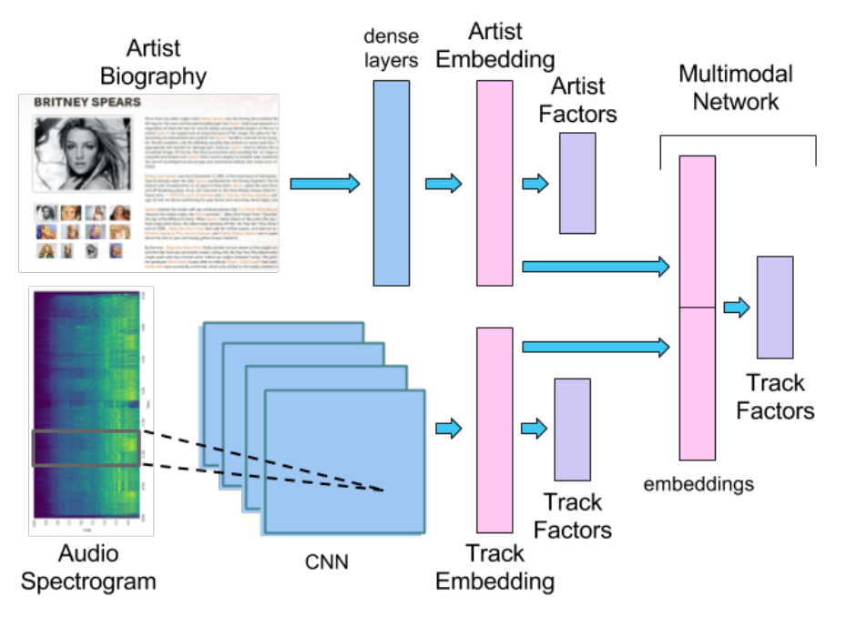

# MusicRecommender

MusicRecommender is a python module for Deep Learning experiments on Audio and Text combination. 


## Dataset

There are three types of dataset.

* Artist biographies
* Audio embeddings which are preprocessed
* User preference matrix based on play counts

Full dataset is described in http://mtg.upf.edu/download/datasets/msd-a

For the music recommendation, artist biographies are preprocessed by TF-IDF and audio files are preprocessed by spectograms and patches.


## Model architecture




## Prediction

```python
import warnings
warnings.filterwarnings(action='ignore')
```


```python
from MusicRecommender import MusicRecommender

mr = MusicRecommender()
mr.recommend()
```

    Using TensorFlow backend.
    Using cuDNN version 7601 on context None
    Mapped name None to device cuda: GeForce RTX 2070 (0000:01:00.0)
    Using Theano backend.
    

    Preprocessing is completed.
    
    Loading Data...
    Training data points: 211475
    Validation data points: 26434
    Test data points for: 26435 
    
    Building Network...
    __________________________________________________________________________________________________
    Layer (type)                    Output Shape         Param #     Connected to                     
    ==================================================================================================
    input_1 (InputLayer)            (None, 10000)        0                                            
    __________________________________________________________________________________________________
    dropout_1 (Dropout)             (None, 10000)        0           input_1[0][0]                    
    __________________________________________________________________________________________________
    dense_1 (Dense)                 (None, 512)          5120512     dropout_1[0][0]                  
    __________________________________________________________________________________________________
    dropout_2 (Dropout)             (None, 512)          0           dense_1[0][0]                    
    __________________________________________________________________________________________________
    dense_2 (Dense)                 (None, 512)          262656      dropout_2[0][0]                  
    __________________________________________________________________________________________________
    dropout_3 (Dropout)             (None, 512)          0           dense_2[0][0]                    
    __________________________________________________________________________________________________
    input_2 (InputLayer)            (None, 4096)         0                                            
    __________________________________________________________________________________________________
    lambda_1 (Lambda)               (None, 512)          0           dropout_3[0][0]                  
    __________________________________________________________________________________________________
    lambda_2 (Lambda)               (None, 4096)         0           input_2[0][0]                    
    __________________________________________________________________________________________________
    concatenate_1 (Concatenate)     (None, 4608)         0           lambda_1[0][0]                   
                                                                     lambda_2[0][0]                   
    __________________________________________________________________________________________________
    dropout_4 (Dropout)             (None, 4608)         0           concatenate_1[0][0]              
    __________________________________________________________________________________________________
    dense_3 (Dense)                 (None, 512)          2359808     dropout_4[0][0]                  
    __________________________________________________________________________________________________
    dense_4 (Dense)                 (None, 200)          102600      dense_3[0][0]                    
    __________________________________________________________________________________________________
    lambda_3 (Lambda)               (None, 200)          0           dense_4[0][0]                    
    ==================================================================================================
    Total params: 7,845,576
    Trainable params: 7,845,576
    Non-trainable params: 0
    __________________________________________________________________________________________________
    None
    
    Training...
    Train on 211475 samples, validate on 26434 samples
    Epoch 1/100
    211475/211475 [==============================] - 44s 207us/step - loss: 0.3760 - mean_squared_error: 0.0075 - val_loss: 0.3674 - val_mean_squared_error: 0.0073
    Epoch 2/100
    211475/211475 [==============================] - 44s 206us/step - loss: 0.3553 - mean_squared_error: 0.0071 - val_loss: 0.3642 - val_mean_squared_error: 0.0073
    Epoch 3/100
    211475/211475 [==============================] - 44s 206us/step - loss: 0.3474 - mean_squared_error: 0.0069 - val_loss: 0.3630 - val_mean_squared_error: 0.0072
    Epoch 4/100
    211475/211475 [==============================] - 44s 208us/step - loss: 0.3426 - mean_squared_error: 0.0068 - val_loss: 0.3626 - val_mean_squared_error: 0.0072
    Epoch 5/100
    211475/211475 [==============================] - 44s 207us/step - loss: 0.3391 - mean_squared_error: 0.0068 - val_loss: 0.3625 - val_mean_squared_error: 0.0072
    Epoch 6/100
    211475/211475 [==============================] - 44s 207us/step - loss: 0.3364 - mean_squared_error: 0.0067 - val_loss: 0.3624 - val_mean_squared_error: 0.0072
    Epoch 7/100
    211475/211475 [==============================] - 44s 209us/step - loss: 0.3341 - mean_squared_error: 0.0067 - val_loss: 0.3627 - val_mean_squared_error: 0.0072
    Epoch 8/100
    211475/211475 [==============================] - 44s 207us/step - loss: 0.3323 - mean_squared_error: 0.0066 - val_loss: 0.3632 - val_mean_squared_error: 0.0072
    Epoch 9/100
    211475/211475 [==============================] - 43s 205us/step - loss: 0.3307 - mean_squared_error: 0.0066 - val_loss: 0.3634 - val_mean_squared_error: 0.0073
    Epoch 10/100
    211475/211475 [==============================] - 43s 205us/step - loss: 0.3295 - mean_squared_error: 0.0066 - val_loss: 0.3637 - val_mean_squared_error: 0.0073
    Epoch 11/100
    211475/211475 [==============================] - 44s 206us/step - loss: 0.3283 - mean_squared_error: 0.0065 - val_loss: 0.3634 - val_mean_squared_error: 0.0073
    
    Saving trained model model_2 in models/trained_models.tsv...
    
    Predicting for split test data...
    R2 avg:  -0.4694775476241675
    
    Predicting for whole test data...
    Test data points for: 64477
    Prediction is completed.
    
    Evaluating...
    MAP@500: 0.00309
    

## Reference

* https://github.com/sergiooramas/tartarus
* https://arxiv.org/abs/1706.09739